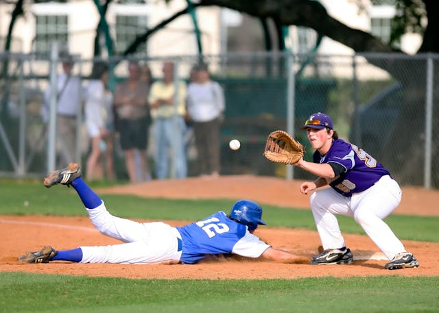
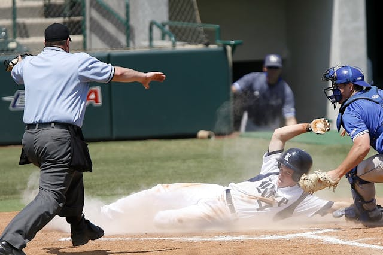

[前文](https://liuchien.ink.tw/工作管理/閒聊scrum敏捷式開發/)原本是想聊聊在筆者經驗中遇到的敏捷式開發議題，不意卻帶出幾個迷思，而透過這些迷思往前推演和找出解答，恰恰也能或多或少讓人更了解敏捷開發的樣貌，所以我決定一一針對先前提出的迷思做延伸探討。

首先是這個迷思:

### *我團隊的研發速度相當慢，是不是應該導入Scrum ?*

說到研發速度慢這件事，在Boss、Engineer兩個族群勢必會掀起一場大戰，為什麼我不提PM呢？因為在我心中，PM應該是跟Engineer同一陣線，換句話說，如果有速度慢這種問題，兩個職位的人都應該一起概括承受。

再回到速度慢這件事情，在開始之前我想說一個歪理，不知道各位重新去審視一個軟體專案從開始到結束的整個過程，像不像是場比賽？我講的不是那種相互較勁、你死我活的鬥爭，而是一場少了一個人都不行的球賽，找個類型來比擬，如果以筆者最喜愛也最熟悉的，那就是非棒球賽莫屬了。

*軟體專案就像一場棒球比賽* Photo by Pixabay on [Pexels.com](https://pixabay.com/photos/athletes-ballpark-baseball-1835893/) 簡單說一下棒球比賽，比賽中有兩個球隊，各有9個球員可以上場，教練團則分別有總教練、首席教練、打擊教練等等等，從投手丟出第一球給對方打擊開始，彼此球員注重的就只有兩件事情，一是想辦法讓自己的球員站上壘包，最後跑回本壘；一是盡量守住壘包，不要讓對方球員跑回本壘；最後，計算兩個隊伍各得了幾分，分數高的獲勝。

撇開軟體專案的最後的付費流程，我們專注在整個案子的進行，從專案經理啟動會議的第一步開始，就好似在球賽丟出第一球，接下來我們要專注地在兩件事情，一是得分、一是避免失分，更好的情況是要得分得的對方心服口服。

當然，我更想告訴你的是，提個發問，如果速度快就等於時間短，那一場時間短的球賽，就篤定是場好球賽嗎？我相信你會有些模擬兩可的答案，若從這個角度回來思考研發速度，那或許你的心中就會有答案了。

開發就像棒球賽一樣, 專注做好份內工作, 比快速更重要。Photo by Pixabay on [Pexels.com](https://www.pexels.com/photo/two-man-playing-baseball-during-daytime-159741/)### 一語畢之, 一個好的開發專案, 就像一場精彩的球賽, 速度未必是最重要的！

當然你還是可以說, 有些球賽還是要講究速度, 畢竟早點打完可以早點休息之類的, 但這不是本篇文章的重點, 我相信喜歡看球賽的人並不在乎時間的長短在對, 但是構成一場好球賽的必要條件是什麼？想當然, 要有天時地利人和, 首先球員實力不能相差太大, 再來大家要鬥志高昂, 接著就要對比戰術高下, 團隊默契, 剩下就看棒球之神眷顧誰了！

在軟體開發的世界, 不外乎也是如此, 你的團隊成員之間不會有太大的落差, 當然我指的不是單一樣技能, 而是對事情的掌控和處理能力, 好比在球賽中, 你不能去比較投手和一壘手的全壘打能力, 畢竟他們本身就肩負不同任務, 但你會希望他們有最好默契, 二壘手、游擊手可以攔下每個被打出的球, 減少投手失分的危機, 更快抓到出局數; 寫程式, 差不多也是這樣, 當你把一個功能往下派, 當然希望他能被有效分工, 然後有效率地被執行完成, 讓負責Backend的人, UIUX的人, 處理商業模式的人接到工作後, 知道自己要做什麼, 也大概知道彼此要做什麼。

而游擊手拋球給一壘手封殺跑者的行為, 通常就像我們研發人員之間會有的共同開發介面一樣, 有了共同的溝通管道, 才能合作無間, 不至於漏了球, 然後一路滾到對方休息區去！不過再講下去可能就偏太遠了,回到原點來看。

引入敏捷式開發的其中一個效益, 是讓你的成員可以確實分工, 再來, 磨合彼此間的默契, 讓大家有共通的溝通管道, 當團隊運作到一個熟悉的程度時, 自然是看到工作時, 就能直觀地知道自己該做什麼事情, 畢竟你是投手, 你不會去搶外野的球吧？

所以, 如果你有一個夠敏捷的團隊, 你可以想見的, 是成員之間有默契, 且知道彼此要做什麼, 任務一派下來, 就能各自去執行, 不需要花時間去做多餘溝通, 我這裡會強調多餘溝通, 是因為溝通還是必要的, 但不需要反反覆覆去確認一些沒有意義的垃圾問題, 無形中也浪費大家的時間。

確保球員可以把球打好！Photo by Pixabay on [Pexels.com](https://www.pexels.com/photo/athlete-authority-ball-ballpark-260998/)所以你需要一個好的棒球教練, 又或者該說, 在敏捷開發中, 你需要一個好的Product Owner, 請注意, 我講的不是Scrum Master, 因為 SM (Scrum Master)專注處理球賽以外的事情, 確保球賽可以正常運作, 但是比賽該怎麼打下去, 則應該是PO (Product Owner) 的責任。

那在有一個好教練的情況下, 你可以培訓出一個精良的隊伍, 訓練有素、默契十足, 面對問題時可以從容應對, 回到球賽來看, 如果戰況順利, 把對手碾壓過去, 自然打完一場比賽的時間就快了, 但是如果戰況膠著, 雙方你來我往, 速度就難講了, 但可以保證的是, 我們至少可以發揮十足十的實力來面對問題, 對吧？

所以導入敏捷開發, 未必可以加速你的專案時間, 但可以把你團隊的實力發揮到百分之百, 能不能加快速度, 就要看你面對什麼樣的案子了。

  
  
  
