* 主要演算法
	1. 通常我們在自然背景拍攝一張照片時，或多或少都會有一些[透視變形](https://zh.wikipedia.org/zh-tw/透视变形)存在，而透視變形是由拍攝和觀看圖像的相對距離決定的，導致遠近特徵的相對比例有變化，產生了彎曲或變形，當然在本例子，我是刻意拍了一張比例歪斜的圖，想要驗證依照公式轉換會得到什麼效果。
	2. 依照解決方法，這樣的變形我們可以下列的聯立方程式來表示：

> ​x = ax’ + by’ + cx’y’ + d
> 
> y = ex’ + fy’  + gx’y’ + h
> 
> ​其中x、y為你原始影像的座標系，x’、y’為校正後的座標系，
> 
> a、b、c、d、e、f、g、h為常數，表示變形關係。
> 
> 

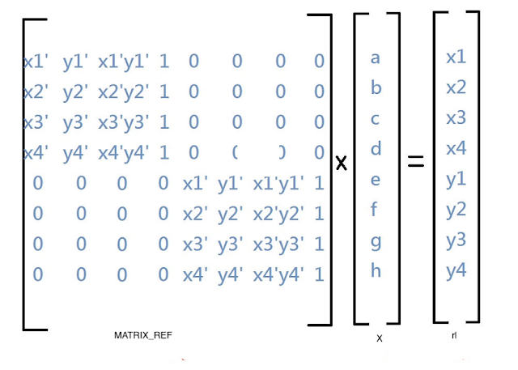

* 程式片段
1. 定義[高斯消去](https://zh.wikipedia.org/zh-tw/高斯消去法)

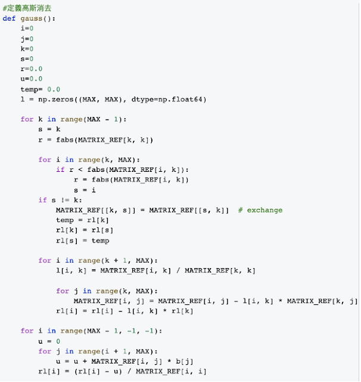

2. 先定義4個點，找出矩陣

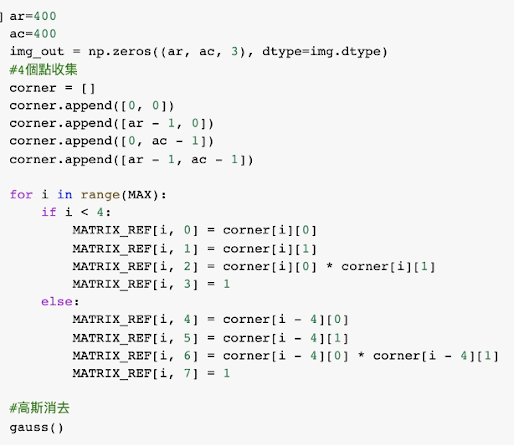

3. 照公式進行矩陣轉換，解出方程式，輸出結果就得到圖片了。

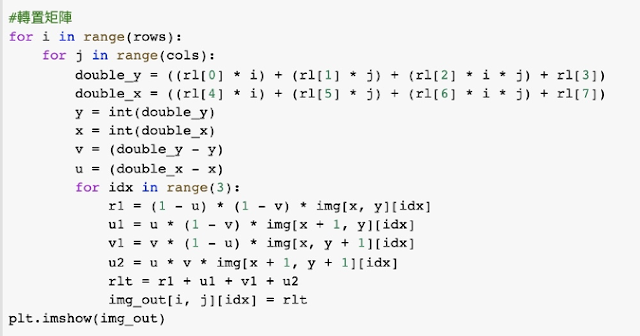

4. 另外我也參考網路範例，仿造OpenCV寫了一個轉置方法，後續比較一下兩種做法的差異。

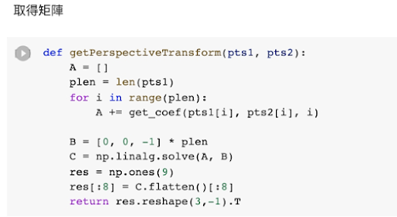

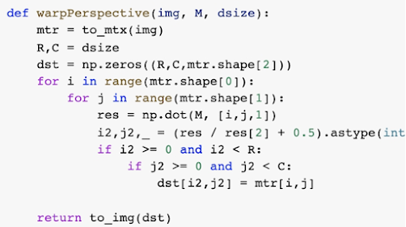

   

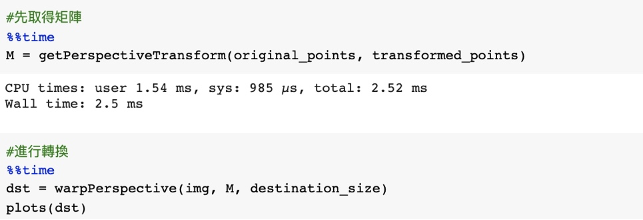

* 測試資料與結果
1. 原圖是張刻意拍歪斜的照片，我標出四個白點，可以看到原始轉換區塊變形到接近菱形了。

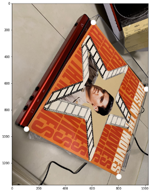

2. 轉換後得到的結果如下，或許是因為變形幅度高，沒達到完整的轉換。

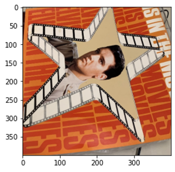

3. 參考網路實作[Perspective Transformation](https://blog.csdn.net/u010925447/article/details/77947398)做出來的效果，因為先做3D後轉2D，校正效果很好，只是程式寫得不好，有失真。

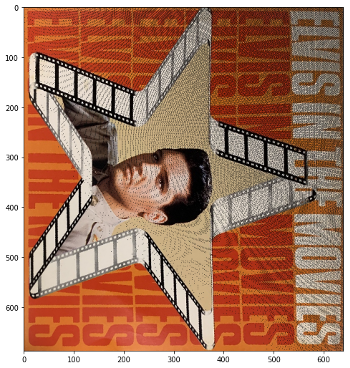

  
  
4. 使用Open CV做的效果

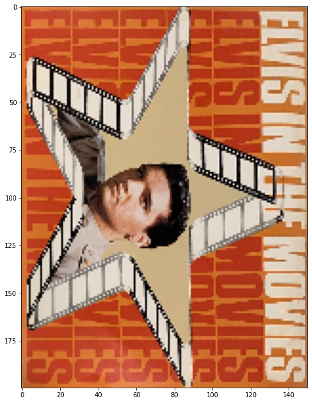

  
  
* 討論

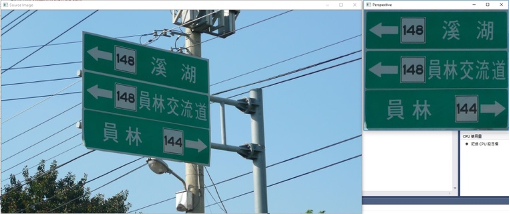

1. 原本課堂講解的校正來源是一個平行四邊形，校正效果相當好，但在本次作用我使用一個不規則的多邊形來做轉換，雖然轉換結果不比原本的好，但還算可以得出資訊。
2. 參考Perspective Transformation實做出來的程式做轉換，對於不規則多邊形轉換的效果很好，只是有失真，若用OpenCV轉出來的話就趨近完美了。
3. 此類的校正可以應用在機器人自駕時的資訊辨認，或是在OCR應用上先把讀入的圖片做校正，在讀取資訊，可以減少判斷失誤。
4. 在Deepfake影片偵測的研究中，許多論文的原理是把影像的Frame讀入後分析他是不是假造影像；如果在深度學習時，我先把人臉或是指定的擷取特徵做校正，可以把每個Frame的特徵變成一樣的構圖，就有機會分辨出他是不是造假的Frame：因為Frame造假是基於原本扭曲變形的畫面做變更，在校正後應該可以看出他和一般正常角度Frame的不同之處。

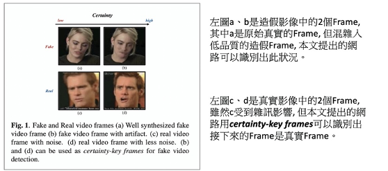

  
  
  
