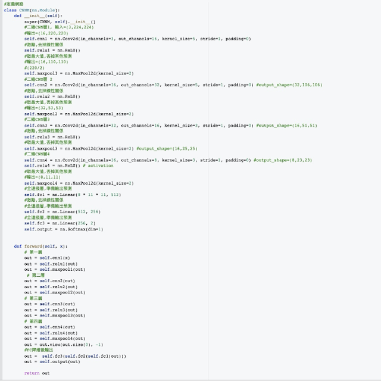
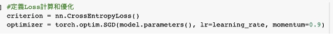
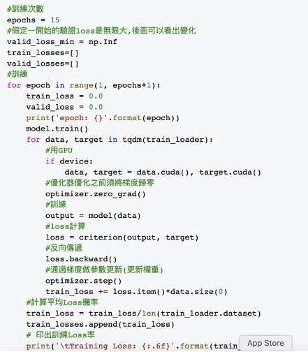
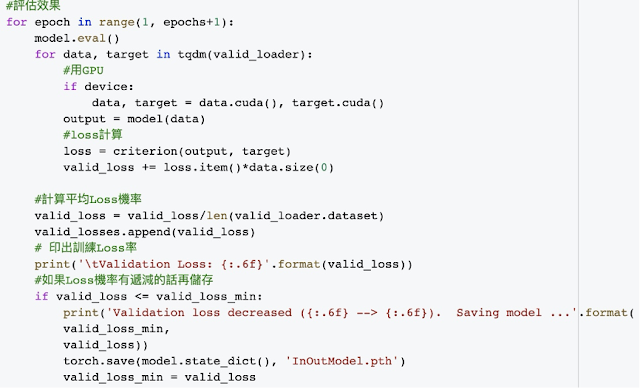
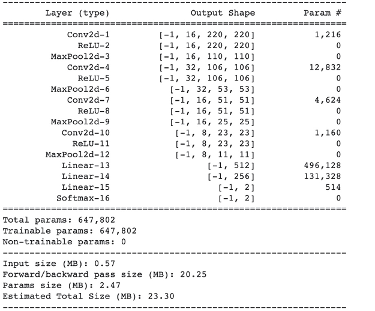
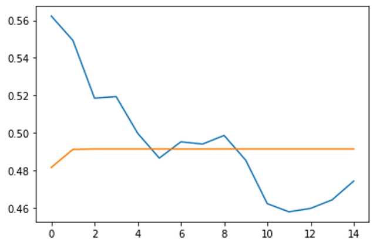
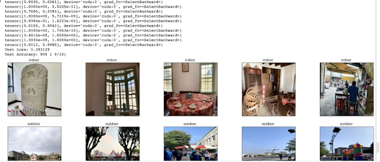
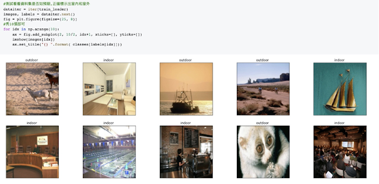

這篇文章是我在修習[影像處理](https://liuchien.ink.tw/學習紀錄/影像處理-修課心得/)時做的作業之一，主要是想訓練一個Model來識別輸入的圖片是在室外環境，還是室內環境，為了完成這個目標，我使用[Pytorch](https://pytorch.org)實作了[卷積神經網絡(Convolutional Neural Network)簡稱CNN](https://en.wikipedia.org/wiki/Convolutional\_neural\_network)，搭配網路上的資料集進行訓練，最後將我隨意亂拍的照片輸入做辨識，發現效果還不錯。

以下節錄我當時整理出來的作業內容，大略解釋了演算法的概念，訓練過程，和最後檢討，因為是作業，故有很多是比較學生角度來解釋整個事件。

* 主要演算法
	1. 室內、室外乍看是二分類，可以用線性回歸(Linear regression)的方式來做，但是考量室內室外只是眾多場景一種，故我用多分類(Multi label classification)的方式開發程式，並用CrossEntropy計算Loss。
	2. 會採用多分類(是因為我單純認為用二分法來識別兩個場景不是很好的方法，最後預測結果會落在0~1之間，若用0.49中位數來分辨0和1，感覺有點奇怪。
	3. 本次使用Pytorch實做一個簡單的CNN網路架構，CNN最主要會由Convolutional和Maxpool兩種層所組成，激勵函數是Relu，然後最後要用線性層(Fully Connected)輸出預測結果。
	4. 初次訓練只用了2層CNN搭配1層的線性層，但訓練的Loss率沒有想像好(低)，故再次修改用4層CNN搭配3層的線性層，一方面想看看線姓層的降維幅度是否也會改善Loss率。
	5. 在訓練、驗證和測試資料夾中，我都定義了Indoor和Outdoor資料夾，同時也是以此當作標籤功能。
	6. 最後輸出時，我們去觀察哪個Label的得分最高，就可以知道他是屬於哪個類型的，假定我規劃0是室內，1是室外，當我發現0的得分是0.9991，1的得分是0.1234，那則代表這張圖是室外。
	7. 訓練過程中，一開始Model會去預測一個分數，但我們會依照正確的分類給他真正的分數，接著算出Loss後，經過backward去更新權重，Model就會知道屬於這張圖真正的分數應該是多少，因此一開始Loss極高是正常的，但會隨著訓練逐漸降低，但是Loss如果隨著訓練持續亂跳亂跳的，那有可能代表圖片的Label太雜亂，Model會精神錯亂，這時候你就必須回頭去檢視你的資料集正不正確。
* 程式片段
	1. 定義網路，4層CNN搭配3層的線性層

  
 本次我是使用多分類方式來做，故採用CrossEntropy的Loss計算。   

  
Crossentropy主要用在計算多分類的交叉熵。本次訓練15次，主要記得開啟訓練模式、梯度歸零和更新等，Model會預測這張圖是屬於哪個類型，一開始Model處於亂猜階段，隨著我們去算出他的Loss率，然後再backward和用step做權重更新後，Model就會學習到正確的分類。

  
訓練時需把Loss率反向傳播，這樣才能讓整個網路知道辨識的錯誤率為何。驗證也是15次，記得開啟評估模式就好，因為在這裡我們想做的是驗證模型準確率，不需要再把驗證出來的結果反向傳播回模型了。   

  
注意開啟評估模式，藉此來了解你的Model能力。附上網路的形狀

 

  
本次作業規劃的網路形狀。* 測試資料與結果
	1. 訓練和驗證資料集主要來自[https:](https://diode-dataset.org/)[//diode-dataset.org/的Dataset](https://diode-dataset.org)，先人工整理出Train和Valid的資料夾，並在其中切分出Indoor和Outdoor，作為輔助，此外我也定義了Indoor是標籤0，Outdoor是標籤1。
	2. 訓練15次，可參考下圖，藍色為訓練的Loss率，橘色是驗證的Loss率，訓練的Loss率原本逐漸下降，但到後期又急速攀升，初步判斷是訓練Label雜亂造成？但因為訓練次數不夠多，如果訓練100次仍這樣亂跳，那就有可能代表圖片的Label太亂，造成loss計算不清楚；而驗證的Loss率則在訓練完第1次後趨於平緩。

  
訓練和驗證時，Model的Loss率變化。1. 在網路輸出時主要會得到一個2元素的Tensor，在這裡我沒多做轉換，若是索引0的機率高，則代表這圖是Label 0 Indoor，1的話則是Outdoor。
	1. 訓練15次後進行測試，Loss率0.31左右，得到的成功率是90多%，感覺好像有點厲害，相較先前使用3層CNN搭配一層線性層，有不錯增長。

  

  
 圖片實際預測結果，此10張都是我刻意挑選用來混淆Model的圖片。* 討論
	1. 本次的測試資料集我是用自己拍的10張圖，其中有些我刻意選擇比較怪異的構圖，譬如在樹叢中拍攝帳篷，或是在有雨棚的路邊攤拍攝，並當作是Indoor照，企圖影響網路的判斷。
	2. 承上，之所以會這樣做是因為我認為類神經網路在擷取特徵時，應該是以構圖和色調在抓室內和室外的差別，才故意找一些界定模糊的資料。
	3. 訓練的Loss率亂跳一方面或許和原始資料集也有關，譬如有放在桌上的帆船模型，照理說和室外的海上的船是蠻像的，不過若是加大訓練次數，有機會看到Loss率逐漸趨緩，因為Model將會逐漸分辨出室內和室外該有的色調，進而判斷出正確結果，而不再是被物體的形狀限制。

  
若有機會，會想嘗試把RNN加入到網路中，藉此了解當面對複雜特徵且數量眾多的圖片，Model的學習能力是否有加分效果，當然可預想的是RNN效果未必會比較好。

若是你對本篇文章的原始碼有興趣，[可以參考我的Github連結](https://github.com/liuchiente/Digital\_Image\_Process\_at\_NCHU/blob/main/InDoor%26OutDoorL.ipynb)。

