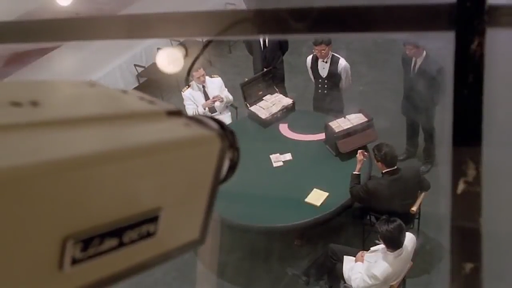
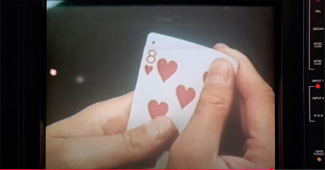
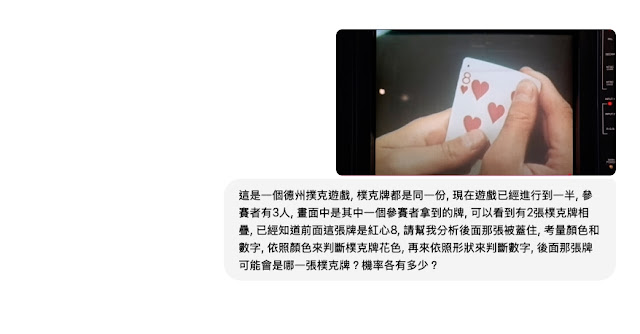
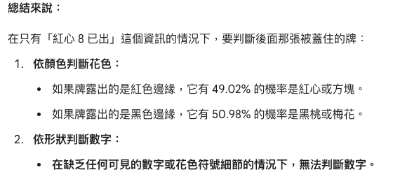
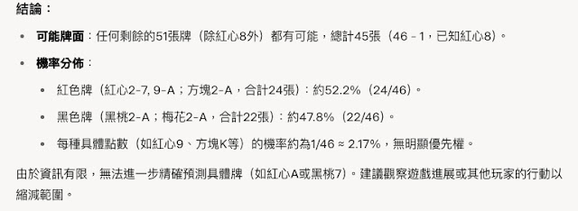
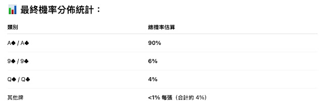
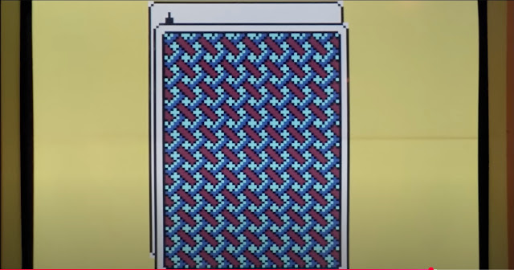
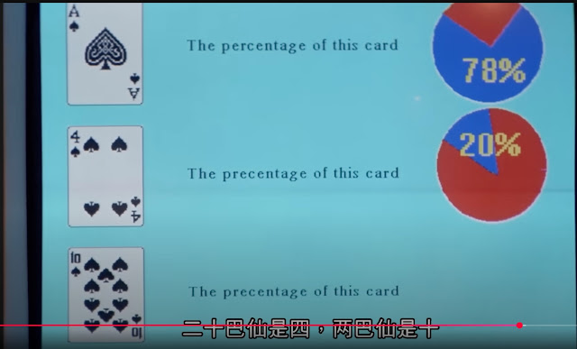
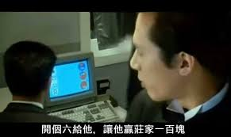
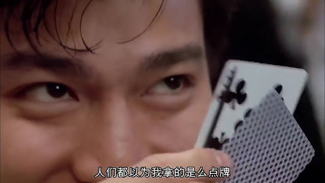

## 賭神2裡的情節

### 用攝影機偷看玩家的牌

## 

## 用現在AI來解問題

### 下個Prompt給他

### 

Google Gemini

  
### Grok

### ChatGPT

  
## 電影裡的AI (?)

### 先解析圖像後

## 

###  分析各種可能

## 

###  然後從控制中心下指令

### 雖然這結果讓人猜不透

## 結論

科普一下，這裡用到的是多模態人工智慧，多模態人工智慧(Multimodal AI)，是指同時利用各種類型（包括文字、圖像、影片、語音…）或模態的資料形成洞察、做出預測和產生內容的人工智慧系統。   
回到本文，乍看之下，海珊的電腦似乎比現在AI都強，不過平反一下，實際上電影情節裡，是參考桌上有多少牌才算出來的，再對比各家AI的結果，令人訝異的是ChatGPT竟然最接近電影裡面的推算，莫非當初訓練語料也有這些內容？Gemini和Grok則是有體認到資訊量不足的問題，哪個比較好，就看使用人的抉擇了。 希望透過本文的介紹， 可以讓大家對多模態人工智慧有更近一步的了解。